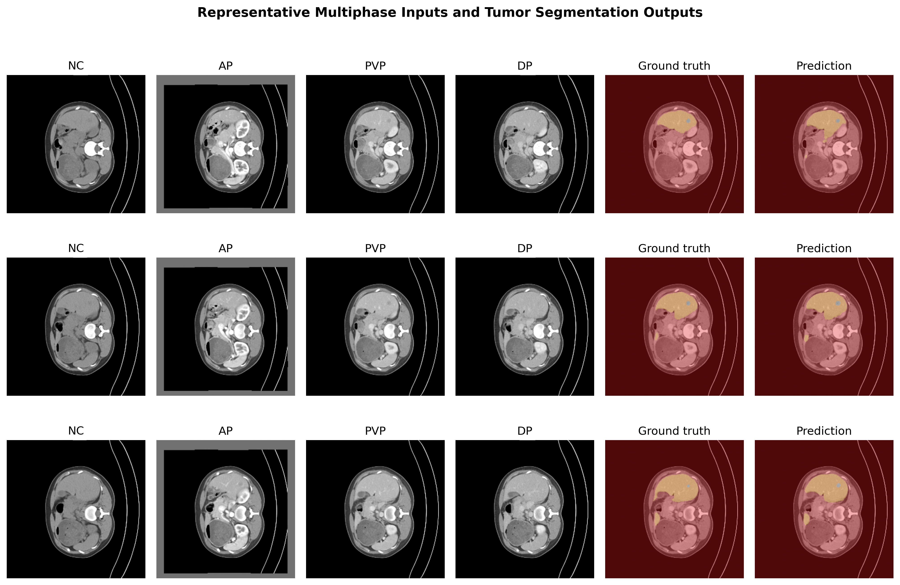
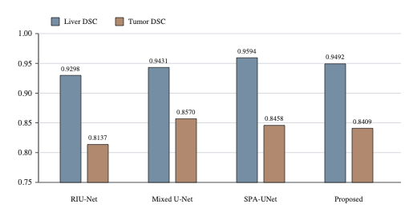
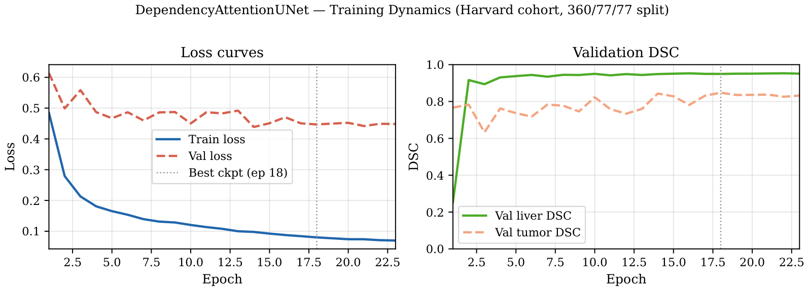
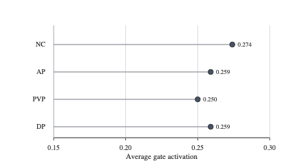
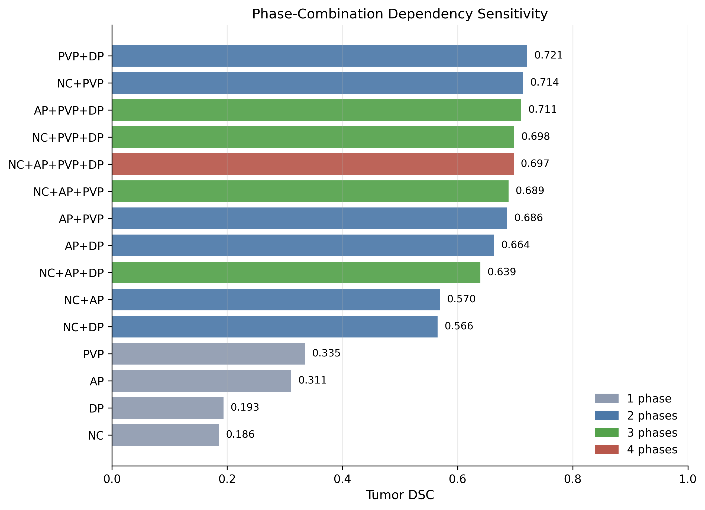
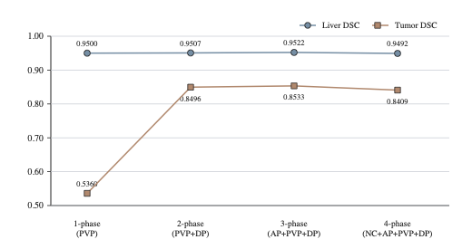

# Dependency-Aware Multi-Phase Liver Tumor Segmentation with Explicit Phase Interaction Modeling

> **ICONIP 2026 submission** — Areeba Naveed, Haider Wajahat  
> School of Science and Engineering, Lahore University of Management Sciences

A deep-learning framework for joint liver and tumor segmentation from four-phase abdominal CT (NC, AP, PVP, DP). The model preserves phase-specific representations through a shared encoder, learns per-phase importance gates, and adds an explicit pairwise cross-phase interaction term before decoding. A complete combinatorial dependency analysis over all 15 non-empty phase subsets is evaluated on the fixed trained model — revealing that phase interaction is **selective, not additive**.



---

## Table of Contents
- [Project Overview](#project-overview)
- [Repository Structure](#repository-structure)
- [Getting Started](#getting-started)
- [Experimental Results](#experimental-results)
- [Citation](#citation)

---

## Project Overview

Multi-phase CT acquires the liver under four contrast conditions — NC, AP, PVP, DP — each revealing different enhancement behavior and lesion conspicuity. Most methods fuse phases through generic channel concatenation, treating phase relationships **implicitly**. This project addresses that gap through:

1. **Phase-specific encoding** — each phase is encoded by a shared per-phase encoder, preserving phase identity until fusion.
2. **Learned phase gating** — per-phase scalar gates g_k ∈ [0.15, 1.0] weight every phase contribution before aggregation.
3. **Explicit pairwise interaction modeling** — pairwise feature products are projected back into the fused bottleneck so the decoder reasons over phase agreement and complementarity.

A central finding: **the all-phase configuration is not the best tumor-performing setting**. Reduced subsets such as PVP+DP (0.8496 tumor DSC) and AP+PVP+DP (0.8533) outperform the full four-phase input (0.8409), demonstrating that multi-phase performance depends not only on having more phases but on how those phases interact.

---

## Repository Structure

```
Phase-Dependency-Liver-Segmentation/
├── README.md
├── requirements.txt
├── src/
│   ├── Phase-3.ipynb          # Single-phase U-Net baseline on LiTS
│   ├── Phase-4.ipynb          # Four-phase Harvard Attention U-Net baseline
│   ├── Phase-5.ipynb          # Intermediate DependencyAttentionUNet
│   └── Phase-6.ipynb          # Final DependencyAttentionUNet (514 patients, 360/77/77)
├── baselines/
│   ├── riunet_baseline.ipynb  # RIU-Net: 2.5D residual-Inception U-Net
│   ├── mixed_unet_baseline.ipynb  # Mixed 2D/3D U-Net
│   └── spa_unet_baseline.ipynb    # SPA-UNet: spatial pyramid U-Net
├── figures/
│   ├── fig1_training_dynamics.png        # Training/validation loss and DSC curves
│   ├── fig2_baseline_comparison.png      # Liver and Tumor DSC across all baselines
│   ├── fig3_phase_gate_importance.png    # Average learned phase-gate activations
│   ├── fig4_all_phase_combinations_tumor_dsc.png  # All 15 subsets ranked by tumor DSC
│   ├── fig5_best_phase_subset_summary.png         # Best subset per cardinality
│   └── fig6_qualitative_predictions.png           # Qualitative segmentation examples
└── research-paper/
    └── MultiPhaseTumor.pdf    # Full paper (ICONIP 2026 submission)
```

---

## Getting Started

**Prerequisites**
- Python 3.8+
- PyTorch, torchvision
- numpy, nibabel, matplotlib, pandas, scikit-image

```bash
pip install torch torchvision numpy nibabel matplotlib pandas scikit-image
```

**Running the code**

```bash
# Clone
git clone https://github.com/areebanaveed-12/Phase-Dependency-Liver-Segmentation
cd Phase-Dependency-Liver-Segmentation

# Run the final model
jupyter notebook src/Phase-6.ipynb
```

| Notebook | Description |
|---|---|
| `src/Phase-3.ipynb` | Single-phase U-Net on LiTS (cross-benchmark reference) |
| `src/Phase-4.ipynb` | Four-phase Harvard Attention U-Net |
| `src/Phase-6.ipynb` | Final DependencyAttentionUNet — 514 patients, 360/77/77 split |
| `baselines/*.ipynb` | RIU-Net, Mixed U-Net, SPA-UNet trained under identical conditions |

> **Data:** The Harvard multi-phase CT cohort is an institutional dataset accessed under a data-use agreement and is not publicly redistributable.

---

## Experimental Results

All Harvard-trained models share the same 360/77/77 patient-wise split, preprocessing pipeline, loss function, optimizer, and inference policy. Architecture is the sole variable.

### Baseline Comparison (77-patient test set)



| Method | Family | Liver DSC | Tumor DSC |
|---|---|:---:|:---:|
| RIU-Net | 2.5D Res-Inception U-Net | 0.9298 | 0.8137 |
| Mixed U-Net | Hybrid 2D/3D U-Net | 0.9431 | 0.8570 |
| SPA-UNet | Spatial pyramid U-Net | 0.9594 | 0.8458 |
| **Proposed** | **DependencyAttentionUNet** | **0.9492** | **0.8409** |

### Training Dynamics



Best checkpoint at epoch 18, selected by `0.35 · DSC_liver + 0.65 · DSC_tumor`. Early stopping triggers at epoch 23.

### Learned Phase-Gate Importance



| Phase | Mean Gate |
|:---:|:---:|
| NC | 0.274 |
| AP | 0.259 |
| PVP | 0.250 |
| DP | 0.259 |

Gates emerge from the segmentation objective alone with no phase-importance supervision. The near-uniform distribution reflects balanced phase utility in the 2.5D setting; NC receives the highest weight, consistent with its role as a stable pre-contrast anatomical reference.

### Complete Combinatorial Dependency Analysis

The fixed trained model was evaluated under all 15 non-empty phase subsets on the held-out test split:



| Input Phases | N | Liver DSC | Tumor DSC |
|---|:---:|:---:|:---:|
| NC | 1 | 0.8476 | 0.2362 |
| AP | 1 | 0.9099 | 0.3960 |
| **PVP** | **1** | **0.9500** | **0.5360** |
| DP | 1 | 0.9004 | 0.3746 |
| NC+AP | 2 | 0.9228 | 0.6966 |
| NC+PVP | 2 | 0.9364 | 0.7250 |
| NC+DP | 2 | 0.9097 | 0.7076 |
| AP+PVP | 2 | 0.9546 | 0.8220 |
| AP+DP | 2 | 0.9358 | 0.7925 |
| **PVP+DP** | **2** | **0.9507** | **0.8496** |
| NC+AP+PVP | 3 | 0.9491 | 0.8078 |
| NC+AP+DP | 3 | 0.9342 | 0.8054 |
| NC+PVP+DP | 3 | 0.9447 | 0.8275 |
| **AP+PVP+DP** | **3** | **0.9522** | **0.8533** |
| NC+AP+PVP+DP | 4 | 0.9492 | 0.8409 |



**Key observations:**
1. **PVP dominates single-phase** (0.5360) — consistent with its clinical role in portal venous contrast differentiation.
2. **PVP+DP is the best two-phase subset** (0.8496) — a +31 pp gain over PVP alone, observable only because the model preserves phase identity.
3. **AP+PVP+DP is the best overall** (0.8533) — exceeds the all-phase result (0.8409), showing that adding NC does not help this trained model.
4. **Flexible inference** — unavailable phases are excluded from gate-weighted fusion; the model degrades gracefully without retraining.

---

## Citation

If you use this work, please cite:

```bibtex
@inproceedings{naveed2026dependency,
  title     = {Dependency-Aware Multi-Phase Liver Tumor Segmentation with
               Explicit Phase Interaction Modeling},
  author    = {Naveed, Areeba and Wajahat, Haider},
  booktitle = {International Conference on Neural Information Processing (ICONIP)},
  year      = {2026},
  publisher = {Springer}
}
```

Key references this work builds on: U-Net (Ronneberger et al., MICCAI 2015), Attention U-Net (Oktay et al., MIDL 2018), RIU-Net (Lv et al., BSPC 2022), PA-ResSeg (Xu et al., Medical Physics 2021), PA-Net (Liu et al., CMPB 2024), Focal Loss (Lin et al., ICCV 2017), Focal Tversky Loss (Abraham & Khan, ISBI 2019).

---

## Authors

- **Areeba Naveed** — 27100239@lums.edu.pk
- **Haider Wajahat** — 27100252@lums.edu.pk

School of Science and Engineering, Lahore University of Management Sciences, Pakistan
